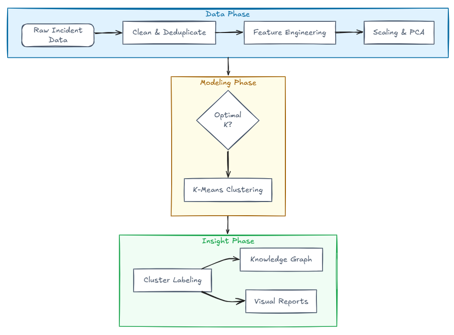
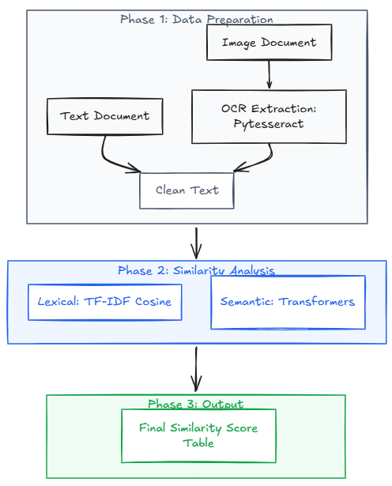

# NewRocket Case Study: Hemanth Chebiyam

## Task 1: ITSM Incident Clustering

### Objective
Take an open-source data set of ticket data and create clusters

### Dataset
[Incident Management Dataset (UCI)](https://archive.ics.uci.edu/dataset/498/incident+management+process+enriched+event+log)  
This dataset contains real-world IT incident records used for clustering and analysis.

Reference: Amaral, C., Fantinato, M., & Peres, S. (2018). Incident management process enriched event log [Dataset]. UCI Machine Learning Repository. https://doi.org/10.24432/C57S4H.

### Methodology
1. **Preprocessing**: Deduplication of events, mapping ordinal severity scales, and engineering `resolution_time_hrs`.
2. **EDA**: Visualization of incident volume, distributions, and top categories.
3. **Dimensionality Reduction**: **PCA** for feature variance analysis.
4. **Clustering**: **KMeans** with optimal *k* determined via Elbow Method and Silhouette Analysis.
5. **Insights**: Named clusters and a Knowledge Graph showing Category ↔ Cluster associations.

### Flow Diagram

---

## Task 2: Document Comparison

### Objective
Compare cross-format documents (Text vs. Image) using OCR and advanced NLP similarity metrics.

### Methodology
1. **OCR Extraction**: `pytesseract` captures text from images/screenshots.
2. **Lexical Similarity**: **TF-IDF Cosine Similarity** for direct keyword overlap.
3. **Semantic Similarity**: **Sentence-Transformers (BERT-based)** for meaning-based overlap.

### Flow Diagram

## Code Notebooks

- [task1_incident_clustering.ipynb](task1_incident_clustering.ipynb)
